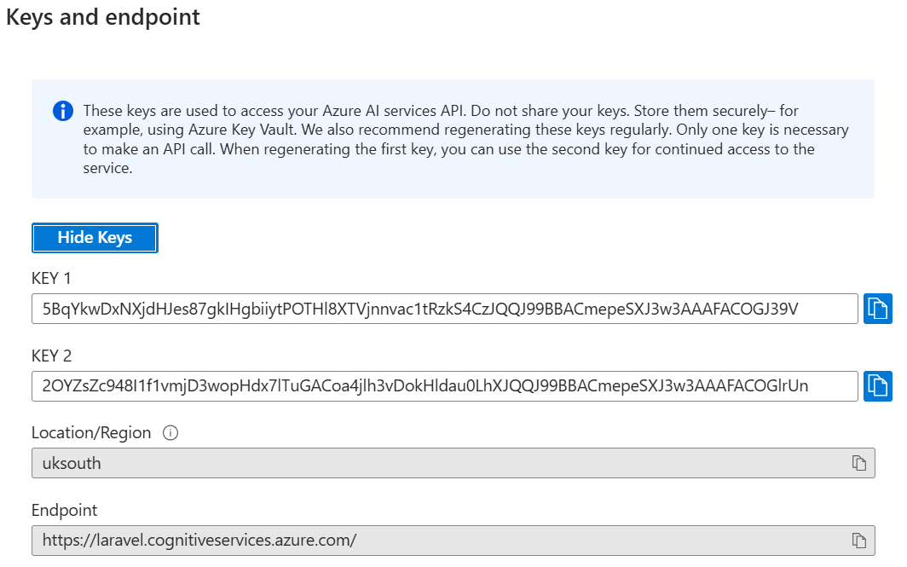

# Animal Vision AI

## Commit, Comment, Branch, & Pull Request Guidelines
- Please refer to CONTRIBUTING.md

### To backup your changes:
1. Create a new repository
2. Run in VSC terminal: git remote add backup your-backup-repo-url
3. Then: git push --mirror backup (If your backup repo is added and you haven't newly cloned, just use this step)

## How To Run
Make sure to have **Laravel Artisan (v11)**, **composer**, **node.js etc.** installed.

### 1. After cloning into htdocs folder, run in VSC terminal (open using Ctrl + J if you have Windows):
1. composer install
2. cp .env.example .env
3. php artisan key:generate

### 2. npm install & npm run dev:
1. Run **npm install**
2. Run **npm run dev**
3. Keep this terminal. When running the website, create a separate VSC terminal using the + icon

### 3. Database:
- Create a MySQL database called **animal-ai** in PHPMyAdmin 

### 4. Make sure env. file is linked to the MySQL database:
- DB_CONNECTION name is **mysql**
- DB_DATABASE name is **animal-ai**
- Username is **root**
- Password is empty

### 4. Migrations & Seeders:
1. Run **php artisan migrate** in terminal
2. Run **php artisan db:seed**

### 5. Running the website:
1. Start **XAMPP Apache** & **MySQL**
2. Run in terminal **php artisan serve** and **Ctrl + Click** on the link that appears
3. If that does not work, manually launch the server using **php -S 127.0.0.1:8000 -t public** http://127.0.0.1:8000/

## Azure AI Computer Vision
1. Go onto microsoft's Azure AI student signup and use your student email to create a account
2. You should access the Azure homepage and create a **computer vision** from **Azure AI Services** (https://portal.azure.com/#home)
3. Scroll to your **.env file** and enter:

**AZURE_VISION_ENDPOINT=**

**AZURE_VISION_KEY=**

4. Azure **ENDPOINT and KEY** are your account's computer vision values you get from using Azure's service. Enter your keys, Example:
